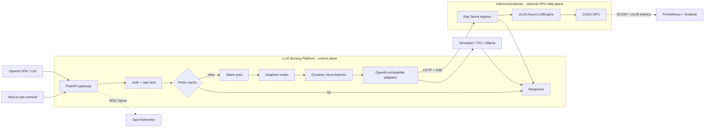

<div align="center">

# LLM Serving Platform

### A production-shaped control plane for low-latency LLM inference

OpenAI-compatible serving with adaptive routing, dynamic micro-batching,
prefix caching, streaming, release controls, and end-to-end observability.

[](https://github.com/xiyiji/llm-serving-platform/actions/workflows/ci.yml)


`adaptive routing` · `micro-batching` · `prefix cache` · `SSE streaming` ·
`canary releases` · `Prometheus metrics`

</div>

This repository is the gateway and operations layer. For a real GPU data
plane, it connects to [InferenceGateway](https://github.com/xiyiji/InferenceGateway),
which runs Ray Serve in front of vLLM and exports GPU and KV-cache telemetry.

Point any OpenAI SDK at it:

```python
from openai import OpenAI

client = OpenAI(base_url="http://localhost:8000/v1", api_key="anything")
reply = client.chat.completions.create(
    model="llama-3.1-8b-instruct",
    messages=[{"role": "user", "content": "hello"}],
)
```


## Architecture



The two batching layers solve different problems: this gateway groups
near-simultaneous requests before dispatch, while vLLM performs engine-level
continuous batching and GPU KV-block scheduling inside the companion engine.

## Technology stack

| Layer | Technology | Responsibility |
|---|---|---|
| API gateway | Python 3.11/3.12, FastAPI, Uvicorn, Pydantic v2, async httpx | OpenAI-compatible API, SSE streaming, backend normalization |
| Traffic control | Adaptive router, token bucket, warm pool | Backend selection, overload protection, cold-start coordination |
| Latency path | asyncio micro-batcher, LRU prefix cache | Request coalescing and cached response fast path |
| GPU engine integration | Ray Serve + vLLM `AsyncLLMEngine` via [InferenceGateway](https://github.com/xiyiji/InferenceGateway) | Continuous batching, PagedAttention, GPU execution |
| GPU telemetry integration | vLLM metrics + NVIDIA DCGM Exporter | GPU utilization and KV-cache occupancy in the companion stack |
| Observability | OpenTelemetry, Prometheus, Grafana, alert rules | Distributed traces, serving metrics, dashboards, alerts |
| Operations UI | Next.js 14, React 18, TypeScript, Recharts | Chat playground, routing health, cache/batch state, release controls |
| Delivery | Docker Compose, Kubernetes, Terraform, AWS ECR/EKS, GitHub Actions | Local stack, deployment manifests, infrastructure and CI |
| Verification | pytest, pytest-asyncio, container smoke test, benchmark harness | 38 tests plus reproducible latency/throughput runs |

## What is implemented here

| Capability | Status | Scope |
|---|---|---|
| OpenAI-compatible completions + SSE | Implemented | Gateway |
| Adaptive multi-backend routing | Implemented | Gateway |
| Dynamic request micro-batching | Implemented | Gateway scheduling, not GPU continuous batching |
| Prefix response cache + warm pool | Implemented | Gateway, not tensor KV-block storage |
| Canary / rolling / blue-green controls | Implemented | In-memory control-plane workflow |
| W3C trace propagation + Prometheus | Implemented | Gateway to upstream HTTP boundary |
| Ray Serve + vLLM + PagedAttention | Companion integration | Implemented in `xiyiji/InferenceGateway` |
| GPU utilization + KV-cache tracking | Companion integration | DCGM and vLLM metrics in `xiyiji/InferenceGateway` |

## Serving path

The gateway ships with a simulated engine so the whole platform — streaming,
routing, batching, caching, releases, dashboards — runs on a laptop with no
GPU and no API key. Switching to a real engine is a config change (below).

**Serving path.** A request hits the prefix cache first; a miss goes through
the warm pool (cold model → load and pool it, LRU/LFU/TTL eviction), then the
router picks a backend by latency and error rate, and the batch scheduler
groups concurrent requests inside an 8 ms window before they reach the engine
adapter. Every hop is measured.

**Operations.** Canary, blue-green and rolling releases with phase tracking
and rollback — including automatic rollback when the observed error rate
crosses a threshold mid-release. Models are registered with versions and
stages (dev/staging/production), and every deployment event lands in the
model's history. Alert rules watch p95 latency, error rate, queue depth and
cold-start time, both in-process (for the console) and as Prometheus rules
(for AlertManager).

**Console.** Three pages: a landing overview, a chat playground that consumes
the SSE stream token by token, and an admin dashboard polling the live
platform APIs — health, backends, batching, cache hit rate, warm pool,
route distribution, alerts, releases and registry. Backend down? Panels
degrade to labelled placeholders instead of a blank page.


## Run it

```bash
# gateway
cd backend
pip install -r requirements.txt
uvicorn app.main:app --port 8000

# console (second terminal)
cd frontend
npm install
npm run dev        # http://localhost:3000
```

Or everything at once — gateway, console, Prometheus, Grafana:

```bash
docker compose up --build
# console http://localhost:3000 · prometheus :9090 · grafana :3001
```

## Measured performance

### Gateway benchmark with the built-in simulator

`bench/benchmark.py` drives the gateway with a closed-loop async load
generator. On the simulated engine (300 requests, concurrency 16, one
warm-up deployment of two models):

| Scenario | p50 | p95 | p99 | Throughput | Cache hits |
|---|---|---|---|---|---|
| Repeated prompts | 35 ms | 1308 ms | 1313 ms | 144 req/s | 94.7% |
| Unique prompts | 77 ms | 108 ms | 132 ms | 190 req/s | 0% |

Two things worth reading off that table: with repeated prompts the cache
serves the median request in half the time of the uncached run, and the tail
is not noise — it is the cold start of the second model (~1.2 s load),
captured exactly where a tail percentile should capture it. Rerun with
`make bench`, or `--unique-prompts` for the cache-off case.

### Recorded GPU-backed run

A separate benchmark run pointed the Render gateway at an on-demand vLLM
engine serving Qwen2.5-7B-Instruct on an RTX 4090 (RunPod). With 60 requests
at concurrency 8 over the public internet, it recorded:

| Scenario | p50 | p95 | Throughput | Cache hits | Errors |
|---|---|---|---|---|---|
| Unique prompts | 3411 ms | 8079 ms | 2.0 req/s | 0% | 0 |
| Repeated prompts | 91 ms | 3315 ms | 12.6 req/s | 85% | 0 |

Unique prompts pay the full price: real 64-token decode on the GPU plus two
public network hops. With repeated prompts the gateway's prefix cache
answers the median request in 91 ms — **37× under the GPU path** — while
misses still stream from the engine. That gap is the reason the gateway
layer exists.

The RunPod engine was an on-demand benchmark target, not an always-on hosted
dependency. The repository remains fully runnable with the built-in simulator;
live GPU inference requires a currently reachable upstream engine.

## Plugging in a real engine

Any OpenAI-compatible server works — vLLM, TGI, Ollama, llama.cpp:

```bash
LSP_UPSTREAM_BASE_URL=http://localhost:8001/v1 \
LSP_UPSTREAM_MODELS=llama-3.1-8b-instruct \
uvicorn app.main:app --port 8000
```

or declare it in `backend/config.yaml` alongside other backends and let the
router split traffic. [`docs/ENGINES.md`](docs/ENGINES.md) walks through
wiring up a vLLM instance — including
[InferenceGateway](https://github.com/xiyiji/InferenceGateway), the
Ray Serve + vLLM engine repo this platform pairs with: that repo is the
engine layer (continuous batching, PagedAttention, GPU metrics), this one is
the gateway layer above it.

## API surface

Generation: `POST /v1/chat/completions` (SSE when `stream: true`),
`POST /v1/completions`, `GET /health`.

Platform state: `/v1/models` (+ `load`/`unload`), `/v1/cold-start/pool`,
`/v1/routing/stats`, `/v1/batch/stats`, `/v1/kv-cache/stats`,
`/v1/backends`, `/v1/stats`, `/metrics`.

Operations: `/v1/deployments` (+ `advance`/`rollback`), `/v1/alerts`,
`/v1/registry` (+ `promote`).

Auth is off by default; set `LSP_API_KEYS=sk-...` to require bearer tokens.
Rate limiting (token bucket per caller, 429 + `Retry-After` on empty bucket)
is on by default and tunable via `LSP_RATE_LIMIT_RPS` / `_BURST`.

## Deploy

[`docs/DEPLOY.md`](docs/DEPLOY.md) covers the three tiers: local compose, a
free public demo on Render + Vercel, and pointing the deployed gateway at a
rented GPU running vLLM for real inference.

`deploy/k8s/` has the manifests (2-replica gateway with probes and rolling
updates, console, HPA, config); `deploy/terraform/` provisions ECR + EKS.
CI runs the test matrix, builds both images and smoke-tests the gateway
container on every push.

## Roadmap

See [governance, streaming and tracing](docs/GOVERNANCE-TRACING.md) for the
promote JSON contract, Admin operations, cache/scheduler boundaries, OTLP setup
and EKS connection outputs.

- Wire the default backend to a live vLLM instance and publish GPU-backed
  benchmark curves alongside the simulated ones
- Move registry and release state from memory to SQLite/Postgres, cache to
  Redis, so the gateway scales horizontally
- Engine-internal spans (gateway and upstream HTTP tracing are implemented)
- Per-key usage accounting and cost attribution
