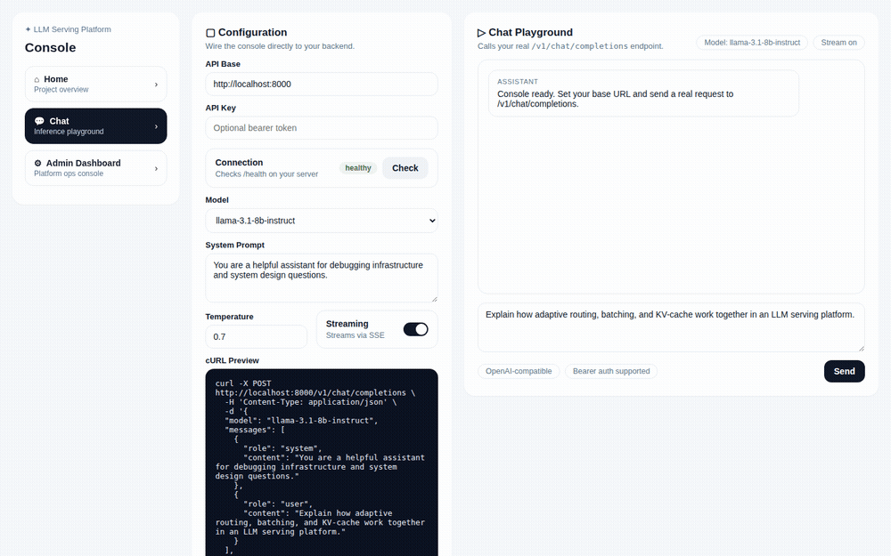
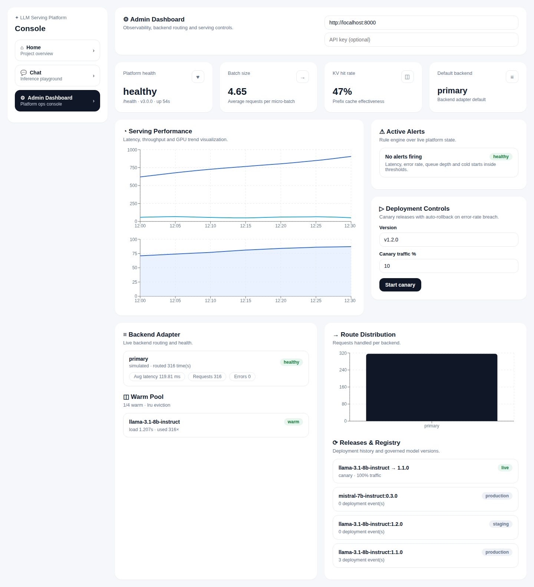

# LLM Serving Platform

A self-hosted serving layer for LLM inference: one OpenAI-compatible gateway in
front of your model engines, with adaptive routing, dynamic micro-batching,
prefix caching, cold-start management, canary releases and a real ops console.

Point any OpenAI SDK at it:

```python
from openai import OpenAI

client = OpenAI(base_url="http://localhost:8000/v1", api_key="anything")
reply = client.chat.completions.create(
    model="llama-3.1-8b-instruct",
    messages=[{"role": "user", "content": "hello"}],
)
```



## Tech stack

| Layer | Choices |
|---|---|
| Gateway | Python 3.11, FastAPI, Uvicorn, Pydantic v2, httpx (async), SSE streaming |
| Serving internals | asyncio micro-batch scheduler, LRU prefix cache, warm pool with LRU/LFU/TTL eviction, latency-aware router, token-bucket rate limiting |
| Console | Next.js 14 (App Router), React 18, TypeScript, Recharts |
| Observability | prometheus-client, Prometheus, Grafana (dashboard committed), alert rules |
| Delivery | Docker, docker-compose, Kubernetes manifests, Terraform (ECR + EKS), GitHub Actions |
| Tests | pytest + pytest-asyncio (27 tests), CI on Python 3.11/3.12, containerised smoke test |

## What's inside

```
                        ┌──────────────────────────────────────────────┐
   OpenAI SDK / curl →  │  Gateway (FastAPI)                           │
   Next.js console   →  │                                              │
                        │  auth ─ rate limit ─ KV cache ─ warm pool    │
                        │            │                                 │
                        │         router ── batch scheduler            │
                        │            │                                 │
                        │      backend adapters                        │
                        └──────┬───────────────┬──────────────────────┘
                               │               │
                        simulated engine   any OpenAI-compatible engine
                        (default, no GPU)  (vLLM / TGI / Ollama / ...)
```

The gateway ships with a simulated engine so the whole platform — streaming,
routing, batching, caching, releases, dashboards — runs on a laptop with no
GPU and no API key. Switching to a real engine is a config change (below).

**Serving path.** A request hits the prefix cache first; a miss goes through
the warm pool (cold model → load and pool it, LRU/LFU/TTL eviction), then the
router picks a backend by latency and error rate, and the batch scheduler
groups concurrent requests inside an 8 ms window before they reach the engine
adapter. Every hop is measured.

**Operations.** Canary, blue-green and rolling releases with phase tracking
and rollback — including automatic rollback when the observed error rate
crosses a threshold mid-release. Models are registered with versions and
stages (dev/staging/production), and every deployment event lands in the
model's history. Alert rules watch p95 latency, error rate, queue depth and
cold-start time, both in-process (for the console) and as Prometheus rules
(for AlertManager).

**Console.** Three pages: a landing overview, a chat playground that consumes
the SSE stream token by token, and an admin dashboard polling the live
platform APIs — health, backends, batching, cache hit rate, warm pool,
route distribution, alerts, releases and registry. Backend down? Panels
degrade to labelled placeholders instead of a blank page.



## Run it

```bash
# gateway
cd backend
pip install -r requirements.txt
uvicorn app.main:app --port 8000

# console (second terminal)
cd frontend
npm install
npm run dev        # http://localhost:3000
```

Or everything at once — gateway, console, Prometheus, Grafana:

```bash
docker compose up --build
# console http://localhost:3000 · prometheus :9090 · grafana :3001
```

## Numbers

`bench/benchmark.py` drives the gateway with a closed-loop async load
generator. On the simulated engine (300 requests, concurrency 16, one
warm-up deployment of two models):

| Scenario | p50 | p95 | p99 | Throughput | Cache hits |
|---|---|---|---|---|---|
| Repeated prompts | 35 ms | 1308 ms | 1313 ms | 144 req/s | 94.7% |
| Unique prompts | 77 ms | 108 ms | 132 ms | 190 req/s | 0% |

Two things worth reading off that table: with repeated prompts the cache
serves the median request in half the time of the uncached run, and the tail
is not noise — it is the cold start of the second model (~1.2 s load),
captured exactly where a tail percentile should capture it. Rerun with
`make bench`, or `--unique-prompts` for the cache-off case.

## Plugging in a real engine

Any OpenAI-compatible server works — vLLM, TGI, Ollama, llama.cpp:

```bash
LSP_UPSTREAM_BASE_URL=http://localhost:8001/v1 \
LSP_UPSTREAM_MODELS=llama-3.1-8b-instruct \
uvicorn app.main:app --port 8000
```

or declare it in `backend/config.yaml` alongside other backends and let the
router split traffic. [`docs/ENGINES.md`](docs/ENGINES.md) walks through
wiring up a vLLM instance — including
[InferenceGateway](https://github.com/xiyiji/InferenceGateway), the
Ray Serve + vLLM engine repo this platform pairs with: that repo is the
engine layer (continuous batching, PagedAttention, GPU metrics), this one is
the gateway layer above it.

## API surface

Generation: `POST /v1/chat/completions` (SSE when `stream: true`),
`POST /v1/completions`, `GET /health`.

Platform state: `/v1/models` (+ `load`/`unload`), `/v1/cold-start/pool`,
`/v1/routing/stats`, `/v1/batch/stats`, `/v1/kv-cache/stats`,
`/v1/backends`, `/v1/stats`, `/metrics`.

Operations: `/v1/deployments` (+ `advance`/`rollback`), `/v1/alerts`,
`/v1/registry` (+ `promote`).

Auth is off by default; set `LSP_API_KEYS=sk-...` to require bearer tokens.
Rate limiting (token bucket per caller, 429 + `Retry-After` on empty bucket)
is on by default and tunable via `LSP_RATE_LIMIT_RPS` / `_BURST`.

## Deploy

[`docs/DEPLOY.md`](docs/DEPLOY.md) covers the three tiers: local compose, a
free public demo on Render + Vercel, and pointing the deployed gateway at a
rented GPU running vLLM for real inference.

`deploy/k8s/` has the manifests (2-replica gateway with probes and rolling
updates, console, HPA, config); `deploy/terraform/` provisions ECR + EKS.
CI runs the test matrix, builds both images and smoke-tests the gateway
container on every push.

## Roadmap

- Wire the default backend to a live vLLM instance and publish GPU-backed
  benchmark curves alongside the simulated ones
- Move registry and release state from memory to SQLite/Postgres, cache to
  Redis, so the gateway scales horizontally
- OpenTelemetry spans end to end (gateway → adapter → engine)
- Per-key usage accounting and cost attribution
